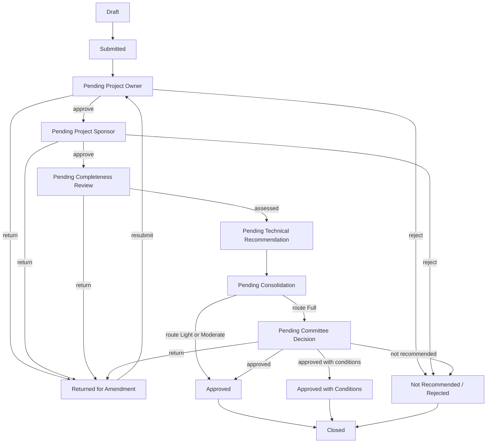

# Blueprint — IT Request Management System

**Status:** POC in design. Companion documents: `architecture.md`, `design.md`,
`database-design.md`, `interface.md`, `project-plan.md`, `compliance-matrix.md`,
`process-improvement.md`.

**Read this first.** It states what is being built, for whom, and what is deliberately not
included. Everything else in `docs/` assumes you have read it.

---

## 1. The Problem

IT investment requests — new systems, enhancements, subscriptions and licences, partnerships —
are captured and routed through a mix of Microsoft Forms, a SharePoint list, email and
spreadsheets.

| Problem | Consequence |
|---|---|
| Two entry points (Organisation Spaces, IT&P SharePoint) | Unclear which is authoritative; requests get lost between them |
| SharePoint list holds the record | 40 columns in one flat row; history lives in emails, not the record |
| Approvals move by email | No way to see who is holding a request, or for how long |
| Returns restart the whole chain | Approvers re-approve work they already approved |
| No due dates anywhere | Requests sit indefinitely; nothing ages, nothing escalates |
| Recommendations chased manually | Three IT units, no visibility of who is outstanding |
| Reporting is a spreadsheet export | Always stale, manually assembled, unreconciled |
| Detail typed as free text | Tier and classification drift, so routing and reporting break |

**The explicit non-goal:** this is not a helpdesk. An "IT Request" here is a formal request for
an initiative, not a fault to be fixed. There is no ticket, no technician, no triage queue and
no priority field. A design that drifts toward ticketing has misread the requirement.

---

## 2. Success Criteria

| # | Criterion | Measured by |
|---|---|---|
| 1 | A requestor can submit a complete request and track it | Request reaches `Submitted` with all conditional fields validated |
| 2 | Two-tier approval works, including when an approver is away | A request clears Owner then Sponsor, with a return in between |
| 3 | Tier and classification are assigned by governance, with the requestor's proposal preserved | Both values present and both visible in audit |
| 4 | Three IT units file independent recommendations that never overwrite | Each unit's version history intact |
| 5 | Only Full-route requests reach the committee | Light and Moderate complete without a committee stage |
| 6 | Requests age against due dates, with reminders and escalation | An overdue task produces a reminder and an escalation |
| 7 | Every material action is attributable | Any transition traces to actor + timestamp + comment |
| 8 | Management can see workload, aging and outcomes | Dashboard totals reconcile with the underlying records |

**The criterion to protect above all others is #7.** The value of this system over an email chain
is that the record is complete and trustworthy. A faster workflow with a gap in its history is a
worse product than a slow one that can be audited.

---

## 3. Users and Roles

Nine roles. Permission scope is enforced server-side on every query — the UI only reflects it.

| Role | Who | Can |
|---|---|---|
| Requestor | Any staff member | Create, save draft, submit, amend, withdraw where allowed, view own requests |
| Project Owner | Named on each request | Review and decide; comment |
| Project Sponsor | Named on each request | Review and decide; comment |
| IT Governance Reviewer | IT Governance | Completeness review, assign tier and classification, route |
| Technical Reviewer | IT Operations / Platforms / Delivery & Governance | Submit a unit recommendation, with conditions and evidence |
| IT HOU / Consolidator | Head of Unit | Consolidate recommendations; determine the governance route |
| Committee Secretariat | ITIC support | Record the committee decision and conditions |
| Administrator | System owner | Users, roles, reference data, templates, configuration |
| Auditor | Read-only | View authorised records and audit evidence |

> **Project Owner and Project Sponsor are named per request**, selected in wizard step 1 — not
> resolved from an org chart. `users.manager_id`, `departments.head_user_id` and
> `divisions.head_user_id` exist for reporting and fallback, not for routing.

---

## 4. Three Independent Reference Sets

The single most important modelling decision. These are **three separate concepts**, decided by
different people at different points. Collapsing them into one field causes rerouting bugs.

| Set | Values | Decided by | When |
|---|---|---|---|
| **Tier** | Tier 1 · Tier 2 · Tier P (Partnership) | IT Governance | Completeness review |
| **Classification** | New System · Enhancement · Subscription/License · Others | IT Governance | Completeness review |
| **Governance Route** | Light · Moderate · Full | IT HOU | Consolidation |

The requestor **proposes** tier and classification at submission; governance **confirms or
changes** them. Both values are stored, so the audit trail shows the change.

The **governance route is not an input** — it is the outcome of consolidation. It is decided
after the technical recommendations are in.

---

## 5. Workflow

Fourteen states, controlled transitions only. A transition is refused unless the actor is
authorised, the prerequisites are met, and the required comment is present. Every transition
writes its history row **in the same database transaction**.

**Return behaviour:** a returned request resumes at the stage that returned it, not at the
beginning. Resubmission from `Returned for Amendment` re-enters the approval that rejected or
returned it. BR-007 requires this; it avoids re-approving what was already approved.

---

## 6. Screens

Nine primary menus, matching the brief's §6.1.

| Menu | Purpose |
|---|---|
| Dashboard | Summary cards, workload, aging, recent activity |
| New Request | Five-step guided wizard |
| My Requests | Drafts, submissions, returned items |
| My Approvals | Owner and Sponsor decision queue |
| Recommendations | Technical review assignments |
| Governance Workspace | Completeness, tier, classification, consolidation |
| Committee Workspace | Agenda and decision recording |
| Reports | Filters, dashboards, exports |
| Administration | Users, roles, reference data, templates, holidays, due dates |

The **request detail** screen is the centrepiece: status timeline, approval trail, per-unit
recommendations, documents, comments, and the audit history. If that screen is right, the rest
follows.

---

## 7. Phases

| Phase | Delivers | Done when |
|---|---|---|
| **A. Design** | Ten documents | Documents reviewed and the field list corrected |
| **B. Prototype** | Clickable HTML, all roles and states | You walk the whole journey and the flow reads correctly |
| **C. Foundation** | Scaffold, auth, roles, layout, CI | A real user logs in, and **one real email arrives** from the host |
| **D. Request module** | Wizard, Sections A and B, attachments | A requestor submits; governance sees it |
| **E. Workflow module** | Approval chain, decisions, returns, delegation | A request clears Owner and Sponsor, with a return |
| **F. Governance module** | Tier, classification, recommendations, consolidation, committee | A Full-route request reaches a committee decision |
| **G. Reporting and admin** | Dashboards, exports, configuration | Management answers "are we meeting our targets?" from the screen |
| **H. Testing and handover** | Tests, deploy, runbook, guides | Live at `itrequest.mwstay.com` with a real request submitted |

Phase B is deliberately before any PHP. Forty field names are still unconfirmed; correcting a
prototype costs minutes, correcting a migrated schema costs a day.

---

## 8. Explicitly Out of Scope (POC)

| Not building | Why |
|---|---|
| Entra ID SSO | Local login for the demonstration; `entra_object_id` is in the schema from day one |
| Redis queue | Not available on this host. Database queue plus a cron worker instead |
| Malware scanning | No scanner available on cPanel. MIME and size checks, files outside the webroot |
| Committee voting | The decision is recorded. No motion, vote or quorum handling |
| Historical data migration | Starts empty with seeded demonstration data |
| Nginx | The host is LiteSpeed/cPanel. Configuration kept portable |
| Delivery and project tracking | The source material ends at `PROCEED NEXT STAGE`; the POC ends at `Closed` |
| Payment, procurement or finance integration | Not in the brief |

These are **declared deviations** from the vendor brief's preferred stack. The brief permits
alternatives with justification and requires material deviations to be stated — see
`compliance-matrix.md` for the justification and the production plan for each.

---

## 9. Risks

| Risk | Impact | Mitigation |
|---|---|---|
| **Email may not work on this host** | FR-010 notifications, reminders and escalations all fail silently | Prove one real email in Phase C, before anything depends on it |
| Field names and option lists unconfirmed | Rework across wizard, schema and seed data | Prototype first; every uncertain field marked `EDIT ME` |
| Approver unavailability stalls a request | The flow's single point of failure | Delegation (FR-014) plus reminders and escalation |
| Post-consolidation process undefined | The POC cannot demonstrate closure convincingly | Scope ends at `Closed`; recorded as an assumption |
| Only one person has the process knowledge | Design reflects one reading | Documents record assumptions explicitly for correction |
| Host PHP version unverified | Framework version may need to drop | Confirm the host PHP version before committing to a version floor |

---

## 10. Decisions Settled

| Question | Decision |
|---|---|
| Tenancy | Single instance per organisation |
| Stack | Laravel + Blade + Livewire + Tailwind (per the brief) |
| Identity | Configurable: local for the POC, Entra ID for production |
| Business hours | Mon–Fri 09:00–18:00, break 13:00–14:00 → 8 working hours per day |
| Due dates | Per stage, in business days, admin-editable |
| Urgency | Captured and shown to approvers; does **not** alter due dates |
| Tier and classification | Requestor proposes, governance confirms; both stored |
| Report numbering | System-generated, unique, configurable |
| Purpose | A demonstration to win management buy-in, not a production release |
