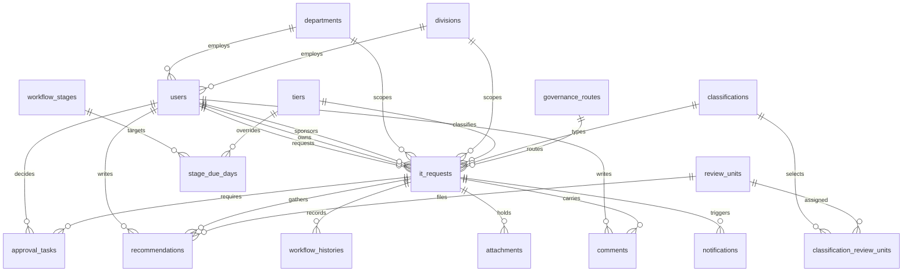

# Database Design — IT Request Management System

**The source of truth for data rules.** Companion documents: `blueprint.md`, `design.md`,
`architecture.md`.

Column names follow the vendor brief's §5.1 schema where the brief names them. Fields marked
`@EDIT ME` are derived from context and must be confirmed against the MS Form.

---

## 1. Principles

| Principle | Consequence |
|---|---|
| The request is the aggregate root | Every child row belongs to exactly one `it_requests` record |
| History is append-only | `workflow_histories`, `audit_logs` and `approvals` are never updated or deleted |
| Money is never a float | `DECIMAL(12,2)`; see §5.2 of the brief |
| Documents live outside the database | `attachments` holds metadata and a path; the file lives in private storage |
| Reference data is data, not code | Tiers, classifications, routes, units and decisions are tables, so an administrator changes them without a deployment |
| Soft delete only where justified | Never on audit evidence (BR-001, BR-006) |
| Timestamps stored UTC, displayed Kuala Lumpur | BR-010 |
| A transition and its history row share one transaction | A crash cannot leave a state change without its record |

---

## 2. Entity Overview



**`departments` and `divisions` are separate tables**, each with its own head. A user belongs to
one department and one division. Both are auto-filled from the identity provider and may be
corrected by governance — a correction is recorded in `audit_logs`.

**`review_units` is not a role.** It is an organisational unit (IT Operations, IT Platforms,
IT Delivery & Governance). A user holds the *Technical Reviewer* role **and** is a member of a
unit. Which units must review a request depends on its classification — see §4.

---

## 3. Core Tables

### `users`

| Column | Type | Notes |
|---|---|---|
| `id` | BIGINT PK | |
| `employee_no` | VARCHAR(50) NULL | From HR / Entra |
| `name` | VARCHAR(255) | |
| `email` | VARCHAR(255) UNIQUE | Login identifier |
| `department_id` | FK → `departments` NULL | Auto-filled from the identity provider |
| `division_id` | FK → `divisions` NULL | Auto-filled from the identity provider |
| `manager_id` | FK → `users` NULL | Reporting line; used for reporting and fallback, **not** routing |
| `entra_object_id` | CHAR(36) NULL UNIQUE | **Must exist from the first migration.** Enables the Entra driver swap without a data migration |
| `password` | VARCHAR(255) NULL | Null when the identity provider authenticates |
| `is_active` | BOOLEAN default true | Deactivation replaces deletion — see §7 |
| `timestamps` | | |

**Indexes:** `email` (unique), `entra_object_id` (unique), `department_id`, `division_id`,
`is_active`.

> `manager_id` is deliberately **not** the approval mechanism. Approvers are named per request.
> Keeping the column is useful for reporting, and for a fallback when a requestor does not name
> an owner.

### `departments` / `divisions`

| Column | Type | Notes |
|---|---|---|
| `id` | BIGINT PK | |
| `code` | VARCHAR(50) UNIQUE | |
| `name` | VARCHAR(255) | |
| `head_user_id` | FK → `users` NULL | |
| `is_active` | BOOLEAN default true | |

### `roles` / `permissions` / `role_user`

Standard RBAC. Nine roles per `blueprint.md` §3. Reference data, seeded, editable by an
administrator. Permissions are checked server-side on every action; the UI only reflects them.

---

## 4. Reference Data

### `tiers`
`id`, `code` (`T1`, `T2`, `TP`), `name` (`Tier 1`, `Tier 2`, `Tier P (Partnership)`),
`description`, `is_active`, `sort_order`.

> **Note for the rebuild:** in the current SharePoint list, `Tier` is a Choice field with
> `FillInChoice="TRUE"`, meaning users can type a value that is not on the list. This
> implementation deliberately **enforces** the list. Free text here breaks routing downstream.

### `classifications`
`id`, `code`, `name`, `description`, `is_active`, `sort_order`.

Values: New System · Enhancement · Subscription/License · Others.
**Others is a first-class category**, not an escape hatch — for example a project team
purchasing tablets for project use.

### `governance_routes`
`id`, `code`, `name` (`Light`, `Moderate`, `Full`), `requires_committee` BOOLEAN,
`is_active`, `sort_order`.

**`requires_committee` is the routing rule** — only `Full` sets it true, which is why only Full
reaches the ITIC.

### `review_units`
`id`, `code`, `name`, `is_active`, `sort_order`.
Values: IT Operations · IT Platforms · IT Delivery & Governance.

### `classification_review_units`
| Column | Type | Notes |
|---|---|---|
| `classification_id` | FK → `classifications` | |
| `review_unit_id` | FK → `review_units` | |

**Unique:** `(classification_id, review_unit_id)`.

> **Why a pivot and not hard-coded logic.** The requirement is that *which* units review depends
> on the classification, and the exact mapping is not yet confirmed. Seeded with all three units
> against every classification, this table makes the real rule a data change rather than a code
> change. The workflow engine reads it to decide who gets a `recommendations` row.

### `workflow_stages`
`id`, `code`, `name`, `sort_order`, `is_approval` BOOLEAN, `is_governance` BOOLEAN,
`is_committee` BOOLEAN. Seeded from the fourteen states in `blueprint.md` §5.

### `stage_due_days`
| Column | Type | Notes |
|---|---|---|
| `id` | BIGINT PK | |
| `workflow_stage_id` | FK → `workflow_stages` | |
| `tier_id` | FK → `tiers` **NULL** | Null = the default for all tiers |
| `business_days` | SMALLINT | Working days, not calendar days |

**Unique:** `(workflow_stage_id, tier_id)`.

Seeded defaults: Project Owner 3 · Project Sponsor 3 · Completeness 2 · Technical 5 ·
Consolidation 3 · Committee 10.

> `due_at` is computed once, when the stage is entered, and **stored on the task** rather than
> recomputed on read. A stored due date makes the overdue query an indexed
> `where('due_at', '<', now())` instead of business-time arithmetic over every open request.

---

## 5. Request Tables

### `it_requests`

Section A fields first, then Section B, then governance outcomes.

| Column | Type | Notes |
|---|---|---|
| `id` | BIGINT PK | |
| `request_no` | VARCHAR(30) UNIQUE | System-generated (FR-005), immutable (BR-009) |
| `title` | VARCHAR(255) | |
| `request_date` | DATE | |
| `requestor_id` | FK → `users` | |
| `department_id` | FK → `departments` NULL | Snapshot at submission — see the note below |
| `division_id` | FK → `divisions` NULL | Snapshot at submission |
| `project_owner_id` | FK → `users` | Named per request |
| `project_sponsor_id` | FK → `users` | Named per request |
| `proposed_tier_id` | FK → `tiers` NULL | The requestor's proposal |
| `tier_id` | FK → `tiers` NULL | The value governance assigned |
| `proposed_classification_id` | FK → `classifications` NULL | The requestor's proposal |
| `classification_id` | FK → `classifications` NULL | The value governance assigned |
| `governance_route_id` | FK → `governance_routes` NULL | Set at consolidation |
| `status` | VARCHAR(40) | One of the fourteen states; backed by an enum |
| `current_stage` | VARCHAR(40) NULL | The stage awaiting action |
| `business_need` | TEXT | |
| `business_plan_status` | VARCHAR(20) | `aligned` \| `adhoc` |
| `business_plan_reference` | VARCHAR(255) NULL | Required when `aligned` |
| `adhoc_justification` | TEXT NULL | Required when `adhoc` |
| `budget_amount` | DECIMAL(12,2) NULL | Never a float |
| `budget_source` | VARCHAR(100) NULL | |
| `budget_code` | VARCHAR(50) NULL | |
| `funding_type` | VARCHAR(50) NULL | @EDIT ME — option list unknown |
| `urgency` | VARCHAR(20) NULL | Captured and displayed; does not affect due dates |
| `urgency_justification` | TEXT NULL | |
| `risk_summary` | TEXT NULL | |
| `mitigation_plan` | TEXT NULL | |
| `dependencies_constraints` | TEXT NULL | |
| `impact_if_not_implemented` | TEXT NULL | |
| `value_proposition` | TEXT NULL | |
| `in_scope` | TEXT NULL | |
| `out_of_scope` | TEXT NULL | |
| `proposed_start_date` | DATE NULL | |
| `target_completion_date` | DATE NULL | |
| `forecast_resources` | TEXT NULL | |
| `submitted_at` | TIMESTAMP NULL | |
| `closed_at` | TIMESTAMP NULL | |
| `outcome` | VARCHAR(40) NULL | Recorded at closure |
| `timestamps` | | |

**Indexes:** `request_no` (unique), `status`, `current_stage`, `requestor_id`,
`project_owner_id`, `project_sponsor_id`, `tier_id`, `classification_id`,
`governance_route_id`, `request_date`, `submitted_at`.

> **`department_id` / `division_id` are snapshots, not lookups.** They are copied from the
> requestor at submission. If the requestor later transfers department, the historical request
> must still report against the department it was raised in. Live lookup would silently rewrite
> history.

### `approval_tasks`

One row per approver per stage — a chain, not a single approver column.

| Column | Type | Notes |
|---|---|---|
| `id` | BIGINT PK | |
| `request_id` | FK → `it_requests` | |
| `stage` | VARCHAR(40) | Which approval this is |
| `sequence` | SMALLINT | Order within the chain |
| `approver_id` | FK → `users` | |
| `delegated_from_id` | FK → `users` NULL | FR-014 — the original approver when acting by delegation |
| `due_at` | TIMESTAMP NULL | Computed on entry using `stage_due_days` and the business calendar |
| `decision` | VARCHAR(20) NULL | `approved` \| `rejected` \| `returned` |
| `comments` | TEXT NULL | **Mandatory on reject and return** (BR-002) |
| `decided_at` | TIMESTAMP NULL | |
| `timestamps` | | |

**Indexes:** `request_id`, `approver_id`, `decision`, `due_at`.

> `delegated_from_id` is separate from `approver_id` so a delegated decision records **both**
> who acted and who they acted for. Overwriting `approver_id` would lose that, and BR-008
> requires it.

### `recommendations`

Versioned, never overwritten (FR-008, BR-005).

| Column | Type | Notes |
|---|---|---|
| `id` | BIGINT PK | |
| `request_id` | FK → `it_requests` | |
| `review_unit_id` | FK → `review_units` | |
| `reviewer_id` | FK → `users` | |
| `recommendation` | VARCHAR(40) | `recommended` \| `recommended_conditions` \| `not_recommended` |
| `conditions` | TEXT NULL | |
| `evidence` | TEXT NULL | |
| `version_no` | SMALLINT default 1 | Increments; earlier versions are retained |
| `submitted_at` | TIMESTAMP NULL | |
| `timestamps` | | |

**Indexes:** `request_id`, `review_unit_id`, `(request_id, review_unit_id, version_no)`.

> **Why `version_no` rather than update-in-place:** BR-005 requires recommendations to be
> preserved, not overwritten. Three units may revise their position as consolidation
> progresses, and the committee needs the final view *with* the history that produced it.

### `recommendation_consolidations`

| Column | Type | Notes |
|---|---|---|
| `id` | BIGINT PK | |
| `request_id` | FK → `it_requests` | |
| `consolidated_by` | FK → `users` | IT HOU |
| `summary` | TEXT | |
| `governance_route_id` | FK → `governance_routes` | **Decided here** |
| `consolidated_at` | TIMESTAMP | |
| `timestamps` | | |

> This is where `governance_route_id` on `it_requests` is set. Keeping the consolidation as its
> own row preserves *why* a route was chosen, not merely what it was.

### `committee_decisions`

| Column | Type | Notes |
|---|---|---|
| `id` | BIGINT PK | |
| `request_id` | FK → `it_requests` | |
| `recorded_by` | FK → `users` | Secretariat |
| `decision` | VARCHAR(30) | `approved` \| `approved_with_conditions` \| `not_recommended` \| `returned` |
| `conditions` | TEXT NULL | |
| `decided_at` | TIMESTAMP | |
| `timestamps` | | |

Voting, motions and quorum are **out of scope** — a decision is recorded, not counted.

### `workflow_histories`

| Column | Type | Notes |
|---|---|---|
| `id` | BIGINT PK | |
| `request_id` | FK → `it_requests` | |
| `from_stage` | VARCHAR(40) NULL | |
| `to_stage` | VARCHAR(40) | |
| `action` | VARCHAR(40) | |
| `performed_by` | FK → `users` | |
| `remarks` | TEXT NULL | |
| `created_at` | TIMESTAMP | |

**Indexes:** `request_id`, `created_at`.

> **Deliberately separate from `audit_logs`.** `workflow_histories` answers "how did this request
> move?" — a business question, read by the status timeline. `audit_logs` answers "who changed
> what value?" — a compliance question. Merging them makes the timeline either unreadably
> detailed or the audit incomplete.

### `attachments`

| Column | Type | Notes |
|---|---|---|
| `id` | BIGINT PK | |
| `request_id` | FK → `it_requests` | |
| `category` | VARCHAR(50) | @EDIT ME |
| `original_name` | VARCHAR(255) | |
| `storage_path` | VARCHAR(500) | Private disk, outside the webroot |
| `mime_type` | VARCHAR(100) | |
| `size` | BIGINT | Bytes |
| `checksum` | CHAR(64) NULL | Integrity check |
| `uploaded_by` | FK → `users` | |
| `timestamps` | | |

Files are stored on the private disk and streamed through a signed, authorised route. They are
never publicly addressable — that is the difference between a document a requestor can share and
a data leak.

### `comments`

| Column | Type | Notes |
|---|---|---|
| `id` | BIGINT PK | |
| `request_id` | FK → `it_requests` | |
| `user_id` | FK → `users` | |
| `body` | TEXT | |
| `is_internal` | BOOLEAN default false | Governance-only visibility |
| `timestamps` | | |

> `is_internal` implements the brief's §6.3 requirement to keep applicant content separate from
> internal governance discussion. A requestor must never see an internal note, and this is
> enforced in the query, not the view.

### `audit_logs`

| Column | Type | Notes |
|---|---|---|
| `id` | BIGINT PK | |
| `user_id` | FK → `users` NULL | Null for system actions |
| `auditable_type` | VARCHAR(255) | |
| `auditable_id` | BIGINT | |
| `event` | VARCHAR(50) | |
| `old_values_json` | JSON NULL | |
| `new_values_json` | JSON NULL | |
| `ip_address` | VARCHAR(45) NULL | |
| `created_at` | TIMESTAMP | |

**Indexes:** `(auditable_type, auditable_id)`, `user_id`, `created_at`.

**Immutable to ordinary users** (NFR-006). No update or delete path exists in the application;
retention is governed by policy, not by user action.

### `notifications`

| Column | Type | Notes |
|---|---|---|
| `id` | BIGINT PK | |
| `user_id` | FK → `users` | |
| `request_id` | FK → `it_requests` NULL | |
| `template` | VARCHAR(80) | |
| `channel` | VARCHAR(20) | `mail` \| `database` |
| `status` | VARCHAR(20) | `pending` \| `sent` \| `failed` |
| `sent_at` | TIMESTAMP NULL | |
| `error` | TEXT NULL | Why a send failed — without this a failed notification is invisible |
| `timestamps` | | |

### `holidays`

| Column | Type | Notes |
|---|---|---|
| `id` | BIGINT PK | |
| `date` | DATE UNIQUE | |
| `name` | VARCHAR(255) | |
| `closes_at` | TIME NULL | Null = closed all day; a time = half-day |
| `source` | VARCHAR(20) | `manual` \| `api` \| `ical` |
| `external_id` | VARCHAR(255) NULL | For reconciling a feed |
| `manually_overridden_at` | TIMESTAMP NULL | Shields admin edits from the next sync |
| `timestamps` | | |

> **A date is either open or closed, so the unique key is `date` alone** — provenance lives in
> `source`. Two holidays on one date is a data error, not a legitimate state.
>
> Malaysian holidays are largely lunar and Islamic, so they cannot be derived — they are entered
> by hand each year. An empty table for the current year silently makes the SLA engine treat
> closed days as working days, so the administration screen **must warn** when the current or
> next year has no entries.

---

## 6. Invariants

These are enforced in code and covered by tests. Each has a specific failure it prevents.

### 6.1 Only one pending approval task per request

A request has at most one `approval_tasks` row with a null `decided_at`. Two pending tasks would
mean two people can approve the same stage, and the second would silently overwrite the first.

### 6.2 Submitted requests cannot be deleted by ordinary users

BR-001. Enforced by policy, not by soft delete. A requestor withdraws; only an administrator
removes, and only with an audit record.

### 6.3 A rejected or returned decision requires comments

BR-002. Enforced in the FormRequest **and** as a database-level check, because an approver
rejecting without a reason leaves the requestor with nothing to act on.

### 6.4 An approver cannot edit the requestor's justification

BR-004. The approval action writes `approval_tasks` only. It never writes to the `it_requests`
justification columns.

### 6.5 Recommendations are never overwritten

BR-005. A revision inserts a new row with `version_no + 1`.

### 6.6 Closure requires all mandatory decisions and documents

BR-006. Checked before the transition is permitted.

### 6.7 System-managed fields are not editable through request screens

BR-009. `request_no`, `status`, `current_stage`, assigned `tier_id` and
`classification_id`, `governance_route_id` and `outcome`.

### 6.8 Every transition writes history in the same transaction

A state change without its history row would be an unauditable request — the one outcome this
system exists to prevent.

---

## 7. Deletion and Retention

| Data | Treatment |
|---|---|
| Requests | Never hard-deleted once submitted. `Withdrawn` is a status, not a deletion |
| Users | `is_active = false`, never deleted — history references them |
| Attachments | Retained with the request; removal is administrative and audited |
| `workflow_histories`, `audit_logs` | Append-only, no delete path in the application |
| `notifications` | Prunable by age; they are operational, not evidential |

Retention periods are **out of scope for the POC** and must be agreed before production
migration (brief §5.2).

---

## 8. Migration Order

Order matters: foreign keys require their targets to exist first.

```
1.  departments, divisions
2.  users                       (includes entra_object_id from the start)
3.  roles, permissions, role_user
4.  tiers, classifications, governance_routes, review_units
5.  classification_review_units
6.  workflow_stages, stage_due_days
7.  holidays
8.  it_requests
9.  approval_tasks
10. recommendations, recommendation_consolidations
11. committee_decisions
12. workflow_histories
13. attachments
14. comments
15. audit_logs
16. notifications
17. settings
```

> **`entra_object_id` must be in migration 2, not added later.** Adding it after users exist
> means matching existing rows to Entra identities by email — which fails for anyone whose
> email has changed, and cannot be verified automatically.

---

## 9. Deliberate Omissions (POC)

| Omitted | Why |
|---|---|
| Historical SharePoint data | Starts empty with seeded demonstration data |
| Full-text search index | `LIKE` queries suffice at POC volumes; see `blueprint.md` §8 |
| Soft deletes on requests | `Withdrawn` covers the real need; soft deletes would complicate every query |
| Multi-tenancy | Single instance per organisation |
| Attachment virus scanning | No scanner on the host. MIME and size validation, private storage |
| Committee voting | The decision is recorded; counts and quorum are out of scope |
| Delivery / project tracking | The source material ends at `PROCEED NEXT STAGE` |
| Field-level encryption | No field in this system holds PDPA-sensitive data of the kind the attendance app encrypts |
