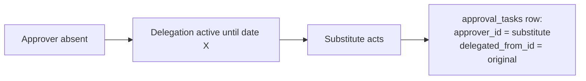
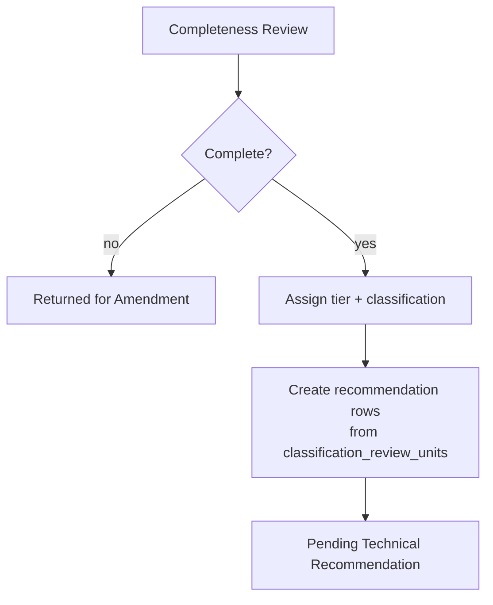

# System Design — IT Request Management System

**How one request moves through the system.** Companion documents: `blueprint.md` (scope),
`database-design.md` (data rules), `architecture.md` (how it is put together).

`architecture.md` answers *how the pieces fit*. This document answers *what happens to a request*.
They are separate so the workflow engine can be reviewed on its own — it is the part most likely
to be wrong.

---

## 1. The Workflow Engine

### 1.1 Design position

The engine is a **guarded state machine**, not a status column. Three things follow from that,
and each prevents a specific failure:

| Rule | Failure it prevents |
|---|---|
| Transitions are defined, never free-text | Anyone could set any status, so the record stops meaning anything |
| Every transition is authorised at the point of the transition | A hidden form field becomes a way to bypass approval |
| Every transition writes history **in the same transaction** | A crash leaves a changed state with no record of who changed it |

> **This is what the current SharePoint list cannot do.** A status column plus edit permission
> means history is whatever the last editor left behind.

### 1.2 The fourteen states

| State | Meaning | Who acts next |
|---|---|---|
| `Draft` | Being written; not yet submitted | Requestor |
| `Submitted` | Submitted and validated | System → Owner |
| `PendingProjectOwner` | With the Project Owner | Project Owner |
| `PendingProjectSponsor` | Owner approved | Project Sponsor |
| `PendingCompletenessReview` | Sponsor approved | IT Governance |
| `PendingTechnicalRecommendation` | Assessed; awaiting unit recommendations | Technical Reviewers |
| `PendingConsolidation` | Recommendations in | IT HOU |
| `PendingCommitteeDecision` | Full route only | Committee Secretariat |
| `Approved` | Approved, no conditions | System → Closed |
| `ApprovedWithConditions` | Approved subject to conditions | System → Closed |
| `NotRecommended` | Rejected at any decision point | System → Closed |
| `ReturnedForAmendment` | Sent back for correction | Requestor |
| `Withdrawn` | Withdrawn by the requestor | — |
| `Closed` | Terminally finished | — |

### 1.3 Transition table

| From | Action | To | Actor | Requires |
|---|---|---|---|---|
| `Draft` | `submit` | `Submitted` | Requestor | All conditional fields valid |
| `Submitted` | `assign_owner` | `PendingProjectOwner` | System | An approval task is created |
| `PendingProjectOwner` | `approve` | `PendingProjectSponsor` | Project Owner | |
| `PendingProjectOwner` | `return` | `ReturnedForAmendment` | Project Owner | **Comment** |
| `PendingProjectOwner` | `reject` | `NotRecommended` | Project Owner | **Comment** |
| `PendingProjectSponsor` | `approve` | `PendingCompletenessReview` | Sponsor | |
| `PendingProjectSponsor` | `return` | `ReturnedForAmendment` | Sponsor | **Comment** |
| `PendingProjectSponsor` | `reject` | `NotRecommended` | Sponsor | **Comment** |
| `PendingCompletenessReview` | `return` | `ReturnedForAmendment` | Governance | **Comment** |
| `PendingCompletenessReview` | `assess` | `PendingTechnicalRecommendation` | Governance | Tier + classification set; recommendation rows created |
| `PendingTechnicalRecommendation` | `submit_recommendation` | *(no change)* | Technical Reviewer | Stays until all assigned units have filed |
| `PendingTechnicalRecommendation` | `all_recommendations_in` | `PendingConsolidation` | System | Every assigned unit has a current recommendation |
| `PendingConsolidation` | `consolidate` | `Approved` | IT HOU | Route = Light or Moderate |
| `PendingConsolidation` | `consolidate` | `PendingCommitteeDecision` | IT HOU | Route = Full |
| `PendingCommitteeDecision` | `decide(approved)` | `Approved` | Secretariat | |
| `PendingCommitteeDecision` | `decide(approved_with_conditions)` | `ApprovedWithConditions` | Secretariat | **Conditions recorded** |
| `PendingCommitteeDecision` | `decide(not_recommended)` | `NotRecommended` | Secretariat | **Comment** |
| `PendingCommitteeDecision` | `return` | `ReturnedForAmendment` | Secretariat | **Comment** |
| `ReturnedForAmendment` | `resubmit` | *(the returning stage)* | Requestor | Corrected fields valid |
| `Draft` / `Submitted` / `Pending*` | `withdraw` | `Withdrawn` | Requestor | Not past consolidation |
| `Approved` / `ApprovedWithConditions` / `NotRecommended` / `Withdrawn` | `close` | `Closed` | Authorised user / System | BR-006 satisfied |

### 1.4 Return behaviour — an important departure from the current process

The current process diagram loops a return back to **"SUBMIT FOR APPROVAL"**, which restarts the
entire chain. A request returned by the Sponsor therefore goes back to the Owner for
re-approval, even though the Owner's decision was not the problem.

**This design resumes at the stage that returned it**, as BR-007 requires:

```
Sponsor returns → ReturnedForAmendment → requestor amends → resubmit
                 → back to PendingProjectSponsor   (not PendingProjectOwner)
```

The returning stage is recorded on the transition, so `resubmit` knows where to go. The full
history remains — `workflow_histories` shows both the return and the resubmission.

---

## 2. Approval Routing

### 2.1 Who approves

Project Owner and Project Sponsor are **named on the request** in wizard step 1. There is no
org-chart lookup. This is deliberate: a named approver is personally accountable and the trail
is unambiguous, whereas a role-based queue lets a request sit unowned.

### 2.2 Delegation

FR-014. When an approver is absent, a delegation record lets a nominated substitute act.



Both identifiers are stored. Recording only the substitute loses *who the decision belonged to*;
recording only the original loses *who actually clicked*. BR-008 requires both.

> **Why this matters more than it looks.** The current flow is strictly sequential with no
> delegation — if the Owner is on leave, every request waiting on them stops. This is the single
> point of failure in the existing process.

### 2.3 Reminders and escalation

Every approval task gets a `due_at` when its stage is entered. A scheduled command then:

| Condition | Action |
|---|---|
| Due within 1 business day | Reminder to the approver |
| Past due | Escalation to the approver **and** the requestor's manager |
| Past due by 3 business days | Escalation to the IT Governance reviewer |

Reminders and escalations are **idempotent**. Each notification records what it sent, so a
re-run of the command does not spam. This matters because holidays can change due dates and
trigger a recomputation.

### 2.4 The business calendar

`due_at` is computed in **business days**, using the configuration below, then stored.

```php
// config/itrequest.php
'business_hours' => [
    'timezone'  => env('ITREQUEST_TIMEZONE', 'Asia/Kuala_Lumpur'),
    'days'      => [1, 2, 3, 4, 5],          // Monday to Friday
    'opens_at'  => '09:00',
    'closes_at' => '18:00',
    'breaks'    => [['13:00', '14:00']],     // 8 working hours per day
],
```

**Verified arithmetic.** With a 09:00–18:00 span and a 13:00–14:00 break, the working intervals
are 09:00–13:00 (4h) and 14:00–18:00 (4h) — **8 working hours per day**. So a 24-working-hour
target is exactly three business days.

Half-days are expressed as a holiday with `closes_at` set, and resolve to the intersection of
the normal intervals with that day's open window:

| Day state | Intervals | Hours |
|---|---|---|
| Normal | 09:00–13:00, 14:00–18:00 | 8 |
| Holiday, closes 13:00 | 09:00–13:00 | 4 |
| Holiday, closes 15:00 | 09:00–13:00, 14:00–15:00 | 5 |
| Full holiday | none | 0 |

> **The application runs in UTC; the business does not.** A due date computed against a naive
> `now()` will land a day early for anything created after 16:00 UTC (midnight in Kuala
> Lumpur). Kuala Lumpur has no daylight saving, so there is no transition to handle — but the
> UTC/local split must be observed everywhere.

### 2.5 Changing the calendar invalidates stored due dates

Adding or removing a holiday, or changing a stage's business days, changes what the correct
`due_at` would have been for **open** requests. So any such change triggers a recompute of
outstanding tasks.

Because the recompute can *shorten* a due date, an already-sent breach flag could re-fire. Breach
and reminder flags are therefore stored per task, set once, and never re-triggered by a
recompute.

---

## 3. Governance Assessment



### 3.1 Tier and classification

The requestor **proposes** both at submission; governance **assigns** both at assessment. Both
values are stored:

| Column | Set by | Purpose |
|---|---|---|
| `proposed_tier_id` / `proposed_classification_id` | Requestor | What was asked for |
| `tier_id` / `classification_id` | IT Governance | What applies |

When governance changes a proposal, the change lands in `audit_logs` with old and new values.
This satisfies BR-009 (system-managed fields are not editable on request screens) **and** keeps
the requestor's original intent visible — which matters when a requestor disputes a
classification later.

### 3.2 Which units review

`classification_review_units` maps a classification to the units that must review it. The engine
reads it, not a constant. Seeded with all three units against every classification, so the real
rule is a data change.

**All assigned units work in parallel.** The request advances to consolidation only when every
assigned unit has a current recommendation — otherwise a single slow unit would hold the request
at a stage where nobody can see why.

---

## 4. Recommendations and Consolidation

### 4.1 Independent, versioned recommendations

FR-008 and BR-005. Each unit writes its own row. A revision inserts `version_no + 1` rather than
updating, so the committee sees the final position *and* how it was reached.

Three units reviewing the same request must never overwrite each other — which is exactly the
failure a single free-text "recommendation" column would produce.

### 4.2 Consolidation determines the route

IT HOU/HOU meeting consolidates and **sets the governance route**. The route is an *output* of
consolidation, not an input from the requestor:

| Route | Requires committee | Next |
|---|---|---|
| Light | No | `Approved` → `Closed` |
| Moderate | No | `Approved` → `Closed` |
| Full | **Yes** | `PendingCommitteeDecision` |

The route is stored on `it_requests` **and** on `recommendation_consolidations`, so the reasoning
survives later questions about why a request did or did not reach the committee.

---

## 5. Notification Design

FR-010. Four triggers:

| Trigger | Recipient |
|---|---|
| A task is assigned | The assignee |
| A decision is made | The requestor, and the next actor |
| A due date approaches | The task holder |
| A task is overdue | The task holder, and escalation targets |

**Delivery is queued, not synchronous.** Sending mail inside the request would make a slow SMTP
server look like a broken application — the approver clicks Approve, the request hangs, and they
click again.

> **The host has no Redis and no worker processes.** The queue driver is the **database**, and a
> cron entry runs `queue:work --stop-when-empty` every minute. This is a declared deviation from
> the brief's "Redis recommended".
>
> **If email does not work from this host, all four of these triggers fail silently.** Nothing
> errors, nothing is logged as a failure, and the request simply sits. This must be proven in
> Phase C before any workflow feature depends on it.

---

## 6. Document Handling

| Concern | Approach |
|---|---|
| Storage | Private disk outside the webroot. Never publicly addressable |
| Access | Streamed through an authorised route; permission checked per request |
| Validation | MIME type and size checked on upload. No malware scanning — **declared deviation** |
| Naming | Original name preserved in the row; the stored name is a generated one |
| Integrity | `checksum` recorded, so a corrupted or substituted file is detectable |

Files are **not** stored in the database (brief §5.2). A BLOB column would make every backup
enormous and every query slower.

---

## 7. Audit Design

Two records, deliberately separate:

| Record | Question it answers | Read by |
|---|---|---|
| `workflow_histories` | How did this request move? | The status timeline |
| `audit_logs` | Who changed what value, and to what? | Compliance and dispute resolution |

**What is recorded:** every transition, every decision, every field change to a system-managed
value, every document upload and download, and every configuration change.

**Immutability.** No update or delete path exists in the application for either table
(NFR-006). A record that can be edited is not evidence.

---

## 8. Process Improvements Baked Into This Design

Full rationale and evidence in `process-improvement.md`. Summarised here because they are design
decisions, not suggestions:

| # | Improvement | Where it lives |
|---|---|---|
| 1 | Controlled vocabularies instead of free text | Reference tables; the UI offers values, not a text box |
| 2 | System-generated request numbers | `request_no` is immutable (BR-009) |
| 3 | Approvals that survive absence | Delegation (§2.2) plus reminders and escalation (§2.3) |
| 4 | Returns resume at the returning stage | §1.4 |
| 5 | Parallel, time-boxed unit reviews | §3.2, with per-unit `due_at` |
| 6 | Per-stage due dates and escalation | §2.3, §2.4 |
| 7 | Explicit closure with a recorded outcome | `outcome` on `it_requests`; BR-006 guard |
| 8 | Live dashboards instead of spreadsheet exports | Reporting module |
| 9 | A single entry point | One application URL |
| 10 | Profile auto-fill with governance correction | §3.1, with the change audited |
