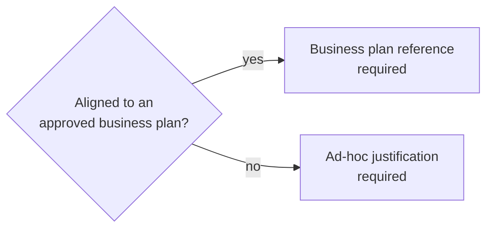

# System Interface — IT Request Management System

**The UI specification.** Companion documents: `blueprint.md` (scope), `design.md` (workflow),
`database-design.md` (fields).

Built with **Blade + Livewire 3 + Tailwind 4** — the vendor brief's named stack.

> **On the word "bootstrap".** An earlier request said "system interface (bootstrap)". The stack
> was then settled as Blade + Livewire + Tailwind, following the brief, so this document treats
> "bootstrap" as *scaffold the interface* rather than *the Bootstrap CSS framework*. If the
> Bootstrap framework was meant, this is the one document to rework — everything else stands.

---

## 1. Design Principles

| Principle | Practical consequence |
|---|---|
| Responsive from 375px up | Mobile is a first-class target, not a degraded one |
| The current stage is always visible | Every request screen shows where it is and what happens next |
| One primary action per screen | No competing calls to action |
| Validation is inline and plain-language | No red banner at the top; the message sits beside the field |
| Applicant and internal content are visibly separate | Governance notes are marked, and never shown to a requestor |
| Irreversible actions confirm first | Submit, reject, close and withdraw all confirm |
| Never rely on colour alone | Status is a badge with text; overdue carries an icon as well as a colour |

---

## 2. Navigation

Nine primary menus, from the brief's §6.1. Sidebar on desktop, bottom sheet on mobile.

| Menu | Route | Visible to |
|---|---|---|
| Dashboard | `/dashboard` | All |
| New Request | `/requests/create` | Requestor, Administrator |
| My Requests | `/requests` | All (scoped: requestors see their own) |
| My Approvals | `/approvals` | Project Owner, Project Sponsor |
| Recommendations | `/recommendations` | Technical Reviewer |
| Governance Workspace | `/governance` | IT Governance Reviewer |
| Committee Workspace | `/committee` | Committee Secretariat, IT Governance |
| Reports | `/reports` | Management, Administrator, Auditor |
| Administration | `/admin` | Administrator |

**Nav is filtered by role, but that is presentation only.** The server authorises every action
independently. Hiding a menu item is convenience; it is not a security control.

A **scope banner** appears for anyone whose visibility is limited — for example an IT
Governance reviewer responsible for one division. Users should never have to guess why a record
is missing.

---

## 3. Screen Inventory

| # | Screen | Purpose | Key elements |
|---|---|---|---|
| 1 | Login | Sign in | Email, password, error |
| 2 | Dashboard | What needs my attention | Cards per role, aging list, recent activity |
| 3 | New Request — wizard | Capture Sections A and B | Five steps, `Save Draft`, progress, conditional fields |
| 4 | My Requests | Track own requests | Filter by status, request number, aging badge |
| 5 | Request Detail | The centrepiece | Status timeline, approval trail, recommendations, documents, comments, audit |
| 6 | My Approvals | Decide | Queue with due dates, approve / return / reject |
| 7 | Governance Workspace | Assess and route | Completeness, tier, classification, consolidation |
| 8 | Recommendations | File a unit recommendation | Recommendation form, conditions, evidence, version history |
| 9 | Committee Workspace | Record a decision | Agenda, decision, conditions |
| 10 | Reports | Workload, aging, outcomes | Filters, charts, export |
| 11 | Admin — Reference data | Tiers, classifications, routes, units | CRUD |
| 12 | Admin — SLA and holidays | Due-day defaults, holiday calendar | Editable grid, year-warning |
| 13 | Admin — Users and roles | Accounts and role assignment | CRUD, deactivate |

---

## 4. The Request Wizard

Five steps from the brief's §6.2, carrying **Section A (Document Information)** and
**Section B (Request Details)** from the source form.

| Step | Section | Fields |
|---|---|---|
| 1 | A | Title, requestor, department, division, Project Owner, Project Sponsor |
| 2 | B | Business need, business-plan status → reference **or** ad-hoc justification |
| 3 | B | Budget amount, source, code, funding type; proposed start, target completion, resources |
| 4 | B | Urgency + justification, risk, mitigation, dependencies, impact if not implemented, value, in scope, out of scope |
| 5 | B | Documents, declaration, preview, submit |

Proposed tier and classification are captured on step 1 as the requestor's *proposal*.
Governance assigns the authoritative values later — see `design.md` §3.1.

### Conditional logic

The one genuinely conditional block, implementing BR-003:



Livewire handles this without page reloads. Other fields may also be conditional on tier,
classification or urgency — marked `EDIT ME` until confirmed.

### Mobile behaviour

The wizard is the hardest screen to make responsive, and at 375px a long form is unusable. So:

| Concern | Approach |
|---|---|
| Step navigation | One step per screen. Never a 40-field scroll |
| Progress | Sticky header showing step 3 of 5, plus a completion indicator per section |
| Long forms | Collapsible sections within a step; only the active one expanded |
| Field layout | One field per row below 640px; two columns above 1024px |
| `Save Draft` | Always reachable in the sticky header |
| Autosave | Every 30 seconds when the form is dirty, with a visible "Saved" indicator |
| Validation on mobile | Inline, and the first invalid field is scrolled into view and focused |
| Submit | Bottom, with a confirmation showing what will happen next |

> **Autosave needs a deliberate rule.** A draft is saved as the requestor types, but only to
> `it_requests` with `status = Draft` — never a partial submit. Abandoning the wizard must leave
> a recoverable draft, not a half-submitted request.

---

## 5. The Request Detail Screen

The screen the project succeeds or fails on. Layout: two columns above 1024px, stacked below.

```
┌───────────────────────────────────────────────┬──────────────────────┐
│ REQ-2026-0042              [Approved with     │ STATUS TIMELINE      │
│ ERP licence renewal          conditions]      │ ✓ Submitted          │
│                                               │ ✓ Project Owner      │
│ Requestor      Ahmad bin Ali                  │ ✓ Project Sponsor    │
│ Department     IT                             │ ✓ Completeness       │
│ Division       Infrastructure                 │ ✓ Technical Rec.     │
│ Owner          Siti Nurhaliza                 │ ● Consolidation  ←   │
│ Sponsor        Tan Wei Ming                   │ ○ Committee          │
│ Tier           Tier 2                         │ ○ Closed             │
│ Classification Enhancement                    │                      │
│ Route          Full                           │ NEXT ACTION          │
│                                               │ Awaiting IT HOU      │
│ ── Section B ────────────────────────────────  │ Due 26 Sep, 2 days   │
│ Business need   ...                           │                      │
│ Budget          RM 45,000                     │ ── APPROVALS ──      │
│ Urgency         High — licence expires 31 Oct │ Owner  ✓ 20 Sep      │
│                                               │ Sponsor ✓ 22 Sep     │
│ ── Recommendations ────────────────────────── │                      │
│ IT Operations   Recommended w/ conditions     │ ── DOCUMENTS ──      │
│ IT Platforms    Recommended                   │ Quotation.pdf        │
│ IT Delivery     Not recommended  ⚠            │ Risk-Assessment.pdf  │
│                                               │                      │
│ ── Comments ───────────────────────────────── │                      │
│ [Internal notes are badged and hidden from    │                      │
│  the requestor]                               │                      │
└───────────────────────────────────────────────┴──────────────────────┘
```

Two design rules this screen exists to enforce:

1. **The status timeline is always visible** — completed, current, future. A user should never
   have to ask "where is this now?".
2. **The next action and its due date are stated in words.** "Awaiting IT HOU · Due 26 Sep,
   2 days" beats a coloured chip.

The **audit history** is a tab, not the default view. It matters, but it is not what most users
need first.

---

## 6. Status Vocabulary

Status meaning must be identical in the UI, in exports and in the API. One source:

| Status | Badge | Meaning to the user |
|---|---|---|
| Draft | grey outline | Not submitted yet |
| Submitted | blue | Submitted, going to the Owner |
| Pending Project Owner | blue | Waiting on the Project Owner |
| Pending Project Sponsor | blue | Waiting on the Project Sponsor |
| Pending Completeness Review | indigo | With IT Governance |
| Pending Technical Recommendation | indigo | With the reviewing IT units |
| Pending Consolidation | indigo | Awaiting IT HOU consolidation |
| Pending Committee Decision | purple | With the IT Investment Committee |
| Approved | green | Approved |
| Approved with Conditions | green, dashed border | Approved, subject to the conditions listed |
| Not Recommended | red | Not approved — see the reason |
| Returned for Amendment | amber | Returned for correction; needs the requestor |
| Withdrawn | grey | Withdrawn by the requestor |
| Closed | grey filled | Finished |

Overdue is **not** a status — it is a property of a task, shown alongside the status so the two
are never confused.

---

## 7. Component Vocabulary

| Component | Use |
|---|---|
| Status badge | Consistent status styling everywhere |
| Status timeline | Vertical, completed/current/future |
| Due-date chip | "2 days left" / "1 day overdue", with icon and colour |
| Approval card | Decision history with actor, timestamp, comment |
| Recommendation panel | One per reviewing unit, with version history |
| Document list | Name, category, size, uploader, date |
| Comment thread | Internal notes visually distinct |
| Empty state | Explains what would appear, and the action that creates it |
| Confirmation dialog | For submit, return, reject, close, withdraw |

**Empty states matter more than usual here.** A first-time user opening My Approvals sees an
empty queue; without an explanation, that reads as a fault rather than an absence.

---

## 8. Accessibility

NFR-005. Concrete commitments:

| Requirement | Implementation |
|---|---|
| Keyboard only | Every action reachable; visible focus rings; no keyboard traps in modals |
| Screen reader | Labelled inputs, `aria-live` for validation and save confirmation, table headers scoped |
| Contrast | WCAG AA minimum (4.5:1 body text) |
| Not colour alone | Status carries text; overdue carries an icon |
| Errors | Described in words beside the field, and announced |
| Motion | No animation that cannot be reduced via `prefers-reduced-motion` |
| Zoom | Usable at 200% without loss of function |

---

## 9. Responsive Breakpoints

| Breakpoint | Layout |
|---|---|
| < 640px (mobile) | Single column; bottom-sheet nav; one field per row; stacked tables become cards |
| 640–1023px (tablet) | Single column with wider gutters; nav collapses to icons |
| ≥ 1024px (laptop) | Sidebar nav; two-column detail layout; tables in full |
| ≥ 1440px (desktop) | Content capped at a readable max-width, centred. **Not** a wider form |

> **Tables are the responsive risk, not the form.** A 40-column request cannot become a
> horizontal scroll on a phone. On mobile, list views render as cards — headline fields visible,
> the rest one tap away.

---

## 10. Prototype

`prototype/index.html` — a single self-contained file, Tailwind via CDN, no build step and no
database. It exists so the screens can be reviewed and corrected **before** the schema is
migrated.

| Property | Value |
|---|---|
| Open | Double-click the file |
| Screens | All 13 in §3 |
| Roles | Switchable, so each role's view can be walked |
| States | Every one of the fourteen, reachable |
| Responsive | Verify at 375px, 768px and 1440px |
| Unknown fields | Marked `EDIT ME` in place |

**Every field derived from context rather than a confirmed source is marked `EDIT ME`.** The
MS Form export could not be read, so the wizard's exact field labels are inferred. Correcting
labels in a prototype takes minutes; correcting them in a migrated schema takes a day.
