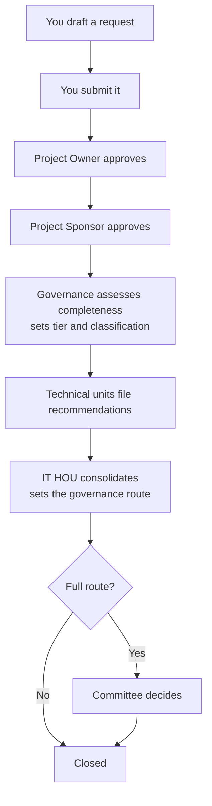

# User Guide

**IT Request Management System** — for everyone who raises, reviews or decides an IT request.

This guide follows the journey a request takes, from the moment somebody decides they need
something to the moment it is closed. Most people are involved in one or two parts of it; the
contents below are grouped so you can read only yours.

| If you are… | Read |
|---|---|
| Raising a request | §1, §2, §3 |
| Approving one | §4 |
| Reviewing one as a technical unit | §5 |
| Assessing or consolidating one | §6 |
| On the committee | §7 |
| Asked to cover for somebody | §8 |
| Just looking | §9 |

Everything you can do is decided by the **roles** on your account. If a menu is missing, you
do not hold the role for it — and the sidebar's **Your scope** note tells you what you can
see. Hiding a menu is not what stops you: the server checks every action independently.
> **How you sign in depends on how the system is set up.** You may be asked for an email address
> and password, or offered a **Sign in with your organisation account** button that takes you to
> Microsoft and back. Both end in the same place. Nothing about the work below changes.
---

## 1. The journey at a glance

**At any point after submission** an approver may **return** the request for amendment. It
comes back to you, you edit it, and you resubmit — and it **resumes at the stage that
returned it**, not at the beginning. That is deliberate: a correction to one section should
not cost a re-approval of everything before it.

A **rejection** is different. It ends the request. There is no way back from a rejection.

---

## 2. Raising a request

**Menu → New Request**

Four short steps. You can stop at any point and come back — press **Save draft** and the
request is kept exactly as you left it. A draft is visible only to you.

### Step 1 — Request information

| Field | Notes |
|---|---|
| Title | A short name. Make it recognisable in a list a year from now, not "New laptop" |
| Request date | Defaults to today |
| Department, Division | Where the request belongs |
| Project Owner | The person who will **approve it first**. Pick a named person, not a queue |
| Project Sponsor | The person who approves it second. May be left blank |
| Proposed tier, classification | **Your proposal.** Governance sets the authoritative values later |

> **The tier changes what the rest of the form asks for.** Choose Tier 2 and the budget source and
> resources become required; choose Tier 1 and they need not be filled in. Fields that do not apply
> to the tier you pick are **not shown**, and a line above the gap names them — so an empty space is
> not a broken screen. If you change the tier after typing, anything that no longer applies is
> **cleared**, and a message tells you what went.

> **The tier follows the budget**, so the amount is required whichever tier you pick. **Tier 1 is
> RM50,000 and below; Tier 2 is above it.** If you choose Tier 1 and enter RM80,000, the form will
> tell you the amount belongs to Tier 2 — that check is there so the tier is not simply whatever
> somebody typed. To change the tier, go back to step 1.

> **Tier P (Partnership) is not in the list.** A partnership is not a cost band — a RM20,000
> collaboration and a RM2,000,000 one are both Tier P — so it is a judgement rather than an
> arithmetic result. IT Governance sets it during completeness review.

> **A named approver is accountable; a queue is not.** This is why the Owner and Sponsor are
> specific people rather than "IT Management". A request with no named owner sits nowhere.

### Step 2 — Business justification

**Business need** (at least a sentence or two — a few words will be refused), then:

**Is this aligned to an approved business plan?** This one answer changes what the form asks
for next:

| Your answer | Then required |
|---|---|
| **Aligned** | The **business plan reference**. A request claiming alignment with no plan cited is refused |
| **Ad hoc** | An **ad-hoc justification**. A request with no business plan and no reason is refused |

This is the only genuinely conditional part of the form, and it is checked on the server as
well as in the browser.

### Step 3 — Budget and timeline

Budget amount, source, code and funding type; proposed start and target completion; resources.

Budget is optional, and this matters: **a request with no cost recorded is exported with a
blank budget, not a zero.** "Free" and "not yet priced" are different things, and a report
that shows a zero for an unpriced request is wrong in a way nobody notices.

Target completion must be on or after the proposed start date.

### Step 4 — Risk and scope

Urgency (**High / Medium / Low**) and — if you choose High — a justification, since an urgent
request is asking to jump a queue. Then risk, mitigation, dependencies, and **impact if not
implemented** (required: a request with no stated consequence is hard to prioritise).

In scope / out of scope are optional but worth filling in. They are what stops the argument
six weeks later about whether something was included.

### Submitting

Press **Submit for approval**. Before it accepts, every step is re-checked, and if something
is wrong it **takes you to the step with the problem** rather than reporting an error against
a field that is not on screen.

On submission you get a **request number** — `REQ-2026-0042` — which is permanent and never
reused. Quote it in any conversation about the request.

> **Save your work as you go.** There is no autosave in this version — nothing is kept until
> you press **Save draft**. If you close the tab first, what you typed is gone.

> **Attaching documents is not available yet.** The vendor quote, the business case and the
> supporting evidence have to be circulated by email for now, and the request can be approved
> and closed without them. The system was specified to hold them; that part is not built.
> Until it is, put the essential detail in the text fields — particularly **impact if not
> implemented** and **in scope / out of scope**, which is where an attachment would otherwise
> have carried the argument.

> **A submitted request cannot be deleted.** Only withdrawn, which stops it where it is and
> leaves the record. That is what makes the trail worth something.

---

## 3. Tracking your requests

**Menu → My Requests** shows your requests. **Open** any of them for the detail screen, which
is the complete story:

- **Status timeline** down the side — where it is, and what has already happened
- **Next action** — who is holding it right now
- The approvers' decisions, with their comments
- Technical recommendations, with the conditions they attached
- **Governance record** — the assessment, the route, the committee decision
- **Audit trail** — every change, by whom, when

### Editing

| Your request is… | You can |
|---|---|
| **Draft** | Edit it, or submit it |
| **Returned for amendment** | Edit it, then **Resubmit** |
| Anything else | Read it. Editing is over |

A returned request shows **Amend and resubmit**, and the status timeline shows which stage
returned it. Resubmitting puts it back at **that stage**.

You may **withdraw** a request that has been submitted. It stops there permanently and cannot
be resubmitted — raise a new one instead.

---

## 4. Approving

**Menu → My Approvals** lists requests waiting on you, oldest first, with due dates. You only
see requests that **name you** as Owner or Sponsor.

Open a task and choose one of:

| Decision | Effect | Comment |
|---|---|---|
| **Approve** | Moves to the next stage | Optional |
| **Approve with conditions** | Moves on, recording the conditions | Conditions required |
| **Return for amendment** | Goes back to the requestor, **at the stage you are at** | **Required** |
| **Reject** | Ends the request permanently | **Required** |

Return and Reject both require a comment, and this is enforced on the server as well as in
the form. A request returned with no explanation is a request that comes straight back.

> **You cannot change the requestor's justification.** The approval records your decision,
> not an edit to their words. If the case is wrong, return it and say so — the trail then
> shows what changed and who asked for it.

**Due dates are targets, not deadlines.** They are set in business days and exclude public
holidays. A task past its due date is marked in the queue and appears in the overdue report —
visible rather than quietly late.

### Covering for somebody

**Menu → My Approvals → arrange cover.** See §8.

---

## 5. Reviewing as a technical unit

If you hold the **Technical Reviewer** role you will be assigned requests that need your
unit's opinion.

**The Recommendations menu does not yet show your queue** — that screen is a placeholder.
Work from **My Requests** or from the request detail screen you are linked to, and use
**File a recommendation** there.

| Field | Notes |
|---|---|
| Recommendation | Your unit's position |
| Conditions | What must be true for you to support it |
| Evidence | What your opinion rests on |

**Filing again creates a new version.** Your earlier position is kept and both are visible to
the committee. That is deliberate: the committee needs to see not only where a unit stands but
**how its position changed**, because a unit that moved after new evidence is a different
situation from one that always agreed.

Units file **independently**. You cannot see another unit's recommendation while writing
yours, and yours is not overwritten by theirs.

> **If your queue is empty when you expect work**, check with an administrator that you belong
> to a review unit. A Technical Reviewer in no unit cannot file a recommendation for anything —
> the units assigned to a request decide who reviews it.

---

## 6. Assessing and consolidating

**Menu → Governance Workspace** is where governance work sits, in five tabs by stage, oldest
first in each.

### Completeness review

Confirm the request is complete, then set the **authoritative tier and classification**. These
override the requestor's proposal — that is the point of the stage.

You can **return** the request here if it is not ready, with a reason.

### Consolidation

Once every assigned unit has filed, the IT HOU:

1. Reviews the recommendations and any conditions
2. **Sets the governance route** — Light, Moderate or Full

The route is what decides whether the committee sees it. **Full route requires a committee
decision before the request can be closed** — and closure genuinely checks this.

> **Closure does not check for documents**, because there is nowhere to attach them. If the
> vendor quote or the business case matters to the decision, the decision has to say so in
> its comments — the system will not require it.

---

## 7. The committee

**Menu → Committee Workspace** shows requests on the **Full route** awaiting a decision.

Record the decision, with conditions where they apply. A committee decision is recorded once
and is visible to everyone who can see the request.

---

## 8. Covering for somebody (delegation)

**Menu → My Approvals**, then arrange cover from there.

| Field | Notes |
|---|---|
| Who you are covering | The approver |
| Who is covering | The person acting in their place |
| From / To | The dates |
| Reason | Why |

While the cover is active, the delegate sees the work in **their** queue, marked as acting for
the original approver.

| Behaviour | Why |
|---|---|
| The delegation **ends by itself** at the end date | Cover that has to be switched off manually stays on after somebody returns |
| Cover can be **revoked early** | A person coming back sooner than expected |
| Revoking **does not delete** the arrangement | Decisions already made under it cite it. A deletion would break the trail |
| The decision records **both** people | The acting approver and the original one. "Who approved this?" has two answers, and both are needed |

> **Arrange cover before you go, not on the day.** The queue is the only place this is
> visible, and it fills up while you are away.

---

## 9. Dashboards and reports

**Dashboard** shows what needs your attention, and the aging list — what has been waiting
longest.

**Reports** (management, governance, administrator and auditor) covers workload, aging,
turnaround, outcomes and overdue work, filtered by period, stage, status, tier and unit.

**Export** downloads exactly the set the screen is showing, with the same filters. Totals on
the screen and rows in the file always reconcile — that is asserted by the test suite, because
a report whose total disagrees with its own rows is worse than no report.

---

## 10. Notifications

When email is configured you receive a message when:

- A request is assigned to you
- A decision is made on your request
- A stage is reached that needs you
- A task of yours is approaching its due date
- A task of yours has passed it

**Email is not configured on this host yet.** The system records every notification it would
send and they appear in the database awaiting delivery — so nothing is lost, and the history
of who was told what is intact. Until it is switched on, treat the queues and the dashboard as
your notification.

---

## 11. Questions that come up

| Question | Answer |
|---|---|
| Can I delete my request? | No. You can withdraw it, which stops it and keeps the record |
| Can I attach the vendor quote? | Not yet — document upload is not built. Put the essentials in the text fields and circulate the rest by email |
| Is my typing saved automatically? | No. Press **Save draft** before closing the tab |
| Can I edit after submitting? | Only if it is returned to you. Otherwise raise a new request |
| Why can I not see a request? | It is outside your scope, or you do not hold the role. The sidebar's **Your scope** note explains |
| Who is holding my request now? | The **Next action** box on the detail screen |
| Why was my request returned? | The comment on the return says so. It is required, so there is always one |
| Can I change the approver? | Not after submission. A returned request can be edited, and the Owner can be changed there |
| What does "Approved with conditions" mean? | Approved, with the conditions recorded. Look at the approval, and at the governance record for how they were carried forward |
| My request is approved — is it finished? | Not necessarily. It still needs the technical recommendations, the route, and — on the Full route — the committee |
| Why is a due date different from when I expected? | Targets are in **business days** and skip public holidays |
| A field I filled in has disappeared | The tier you chose does not use it, so it was cleared. A message above the form says which fields went |
| Why is the budget field gone? | The tier does not ask for a budget. The line above the gap names the fields not applicable to it |
| I switched tier and lost what I typed | Fields a tier does not use are cleared, so nothing is stored that means nothing for that tier. The message names what went. Choosing the tier early avoids this |
| Why is my tier refused? | The amount belongs to a different tier. Tier 1 is RM50,000 and below; Tier 2 is above. Change the tier on step 1 or correct the amount |
| Where is Tier P? | Partnership is not decided by cost, so IT Governance sets it during completeness review rather than you choosing it |
| Where is my audit trail? | On the request detail screen, at the bottom. The system-wide Audit log screen is not built yet |

---

## 12. Where to find out more

| Topic | Document |
|---|---|
| Managing users, roles and the calendar | `administrator-guide.md` |
| How the workflow is designed, and why | `design.md` |
| Every field on every screen | `interface.md` |
| Deploying and running the system | `deployment.md` |
